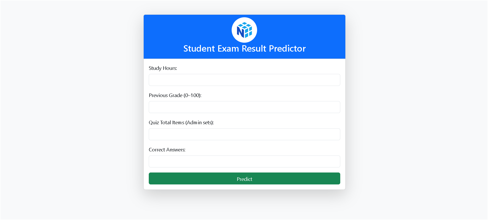

# 🧠 Exam Result Predictor AI

A simple AI web application that predicts whether a student is likely to **pass or fail** an exam based on:
- 📚 Study Hours
- 📊 Previous Grade
- 📝 Quiz Score (based on total items and correct answers)

Built with:
- Python 🐍 (Flask)
- Scikit-Learn 🤖
- Pandas 📈
- Bootstrap 5 for frontend styling 🎨

---

## 🚀 Live Demo

👉 [Click here to try the app](https://your-render-url.onrender.com)  
> Replace with your actual link after deployment.

---

## 🧩 How It Works

The app uses **logistic regression** to predict exam outcomes.  
The trained model is based on sample data and a pass threshold of **75%** confidence.

You enter:
1. Study hours
2. Previous grade (0–100)
3. Total quiz items
4. Number of correct quiz answers

It calculates:
- Predicted result: ✅ Passed or ❌ Failed
- Confidence scores (%)
- Quiz score
- Input summary

---

## 📸 Screenshot



 

---

## ⚙️ Setup Instructions

1. **Clone the repo**:

```bash
git clone https://github.com/yourusername/exam-predictor-ai.git
cd exam-predictor-ai
